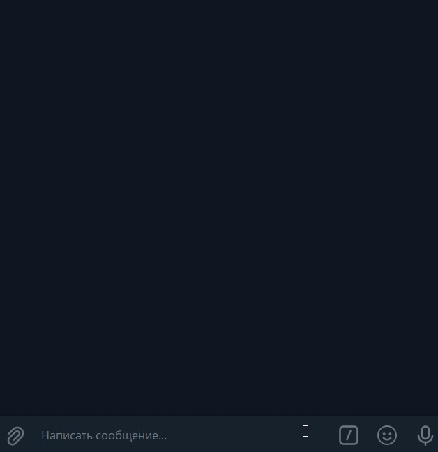

# Бот поддержки клиентов с распознаванием речи

В данном проекте реализованы боты для Telegram и VK для техподдержки клиентов сообщества соцсети. Ключевой функцией проекта является распознавание фраз клиентов посредством Google DialogFlow.

### Как установить и запустить
#### Регистрация DialogFlow
- [Создайте проект в DialogFlow](https://cloud.google.com/dialogflow/docs/quick/setup), сохраните имя проекта
- [Создайте агента](https://cloud.google.com/dialogflow/docs/quick/build-agent)
- [Создайте JSON-ключ](https://cloud.google.com/docs/authentication/getting-started), сохраните JSON-ключ
- [Создайте Telegram бота](https://telegram.me/BotFather), сохраните токен
- Создайте группу ВКонтакте, получите токен группы, перейдя в группу, затем в меню `Настройка -> Работа с API`
- Зарегистрируйтесь на [GitHub](https://github.com)
- Форкните данный [репозиторий](https://github.com/killla/support-bot)
- Зарегистрируйтесь на [Heroku](https://id.heroku.com/login)
- Создайте в Heroku приложение (app)
- На вкладке `Settings` в разделе `Config Vars` введите свои переменные окружения, которые перечислены в главе [Настройка](#настройка) данного README
- На вкладке `Settings` в разделе `Buildpacks` добавьте новый билдпак по [ссылке](https://github.com/gerywahyunugraha/heroku-google-application-credentials-buildpack) 
- На вкладке `Deploy` привяжите свой аккаунт GitHub к аккаунту Heroku
- В графе `Search for a repository to connect to` выберете свой GitHub аккаунт и репозиторий `dvmn_api`
- Нажмите `Search`, затем `Connect`
- Нажмите `Deploy Branch`
- На вкладке `Resources` включите процессы `tg_bot python3 tg_bot.py` и `vk_bot python3 vk_bot.py`

В указанный Telegram-чат придут сообщения `Телеграм бот запущен` и `VK бот запущен`.

### Настройка

Настройки берутся из переменных окружения. В Heroku переменные окружения указываются на вкладке `Settings` приложения в разделе `Config Vars`

Необходимо определить следующие переменные окружения:
- `TG_BOT_TOKEN` - токен Telegram бота поддержки
- `TG_LOG_BOT_TOKEN` - токен Telegram бота для отправки логов (можно одинаковый)
- `TG_LOG_CHAT_ID` - ID пользователя в Telegram
- `GOOGLE_APPLICATION_CREDENTIALS` = `google-credentials.json` - название файла с JSON ключом
- `GOOGLE_CREDENTIALS` - содержимое файла `google-credentials.json`
- `GOOGLE_PROJECT_ID` - название проекта Dialog Flow
- `VK_TOKEN` - токен VK бота

### Обучение бота
Для обучение нужно подготовить файл с вопросами и ответами в формате JSON. 
[Пример](https://dvmn.org/filer/canonical/1556745451/104/) содержимого такого файла.
Файл может быть назван, например, `question.json`, и сохранен в одной папке с `import_qa.py`.

Должны быть заданы переменные окружения `GOOGLE_PROJECT_ID` и `GOOGLE_APPLICATION_CREDENTIALS`.

Файл с JSON-ключом должен лежать рядом, название файла указывается в переменной окружения `GOOGLE_APPLICATION_CREDENTIALS`.

Затем запустить из командной строки:
```
python3 import_qa.py questions.json
```
В параметрах указывается путь к JSON файлу с вопросами и ответами.

### Пример результата
https://t.me/@team_b_test_bot

https://vk.com/im?sel=-149967104



### Цель проекта
Создание ботов для собственных сообществ в социальных сетях.